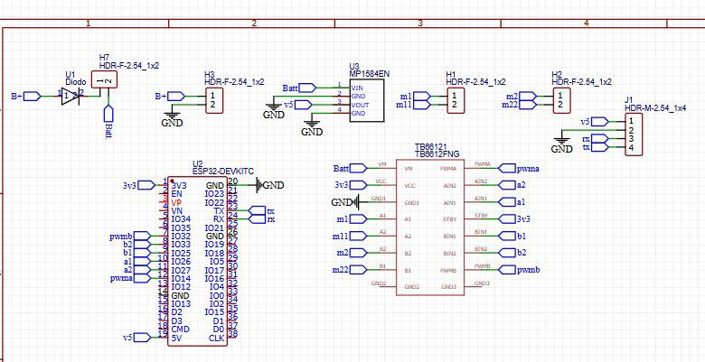

# PCB del robot

Documentación disponible de la placa electrónica usada en los robots.

## Contenido

| Ruta | Descripción |
|---|---|
| `source/SCH_Minisumo-camara_2026-01-12.json` | Fuente exportada del esquemático |
| `imagenes/esquematico.png` | Captura del esquema eléctrico |
| `imagenes/pcb_fabricada.png` | Fotografía de la placa sin ensamblar |
| `imagenes/pcb_montada.png` | Fotografía de la placa montada |

## Componentes principales

- ESP32 DevKitC como controlador y enlace Wi-Fi;
- TB6612FNG como puente H dual;
- LM1584EN como etapa de regulación;
- conectores para motores, alimentación y señales auxiliares.

## Estado de los archivos

El repositorio contiene una fuente de esquemático y evidencia fotográfica. No se
incluyen explícitamente todos los archivos habituales de fabricación, como
Gerbers, taladros, BOM validada, pick-and-place o un proyecto PCB paramétrico
completo.

Por esa razón, la placa no debe mandarse a fabricar directamente a partir de las
fotografías ni asumirse lista para producción.

## Revisión previa a fabricación

1. Abra el JSON en la herramienta que lo generó y confirme que todas las redes
   se importan correctamente.
2. Ejecute comprobación de reglas eléctricas.
3. Verifique encapsulados y numeración de pines.
4. Confirme orientación de ESP32, driver, regulador, diodos y capacitores.
5. Revise anchos de pista para corriente de motores.
6. Compruebe retorno de tierra y desacoplo.
7. Separe adecuadamente potencia de motores y lógica.
8. Genere y revise Gerbers y archivos de taladro.
9. Compare la revisión generada con la placa fabricada que aparece en las fotos.

## Relación con el firmware

Los sketches actuales esperan:

| Función | GPIO |
|---|---:|
| `STBY` | `13` |
| Motor A `IN1` | `25` |
| Motor A `IN2` | `33` |
| Motor A `PWM` | `32` |
| Motor B `IN1` | `26` |
| Motor B `IN2` | `27` |
| Motor B `PWM` | `14` |

Confirme esas conexiones contra el esquemático antes de cargar el firmware.
**Motor A** y **Motor B** son canales eléctricos; la asignación física
izquierda/derecha se calibra en el sketch.

## Primera energización

- Inspeccione cortos y soldaduras.
- Mida continuidad entre alimentación y tierra.
- Encienda primero con fuente limitada en corriente.
- Compruebe tensiones sin motores conectados.
- Verifique que el regulador y el driver no se calienten.
- Conecte un motor a la vez y use PWM bajo.
- Pruebe finalmente ambos motores con las ruedas elevadas.

## Advertencia

La corriente de bloqueo de un motor puede superar ampliamente su corriente en
vacío. Dimensione pistas, conectores, batería y driver para el caso real, y
mantenga una parada física accesible.
